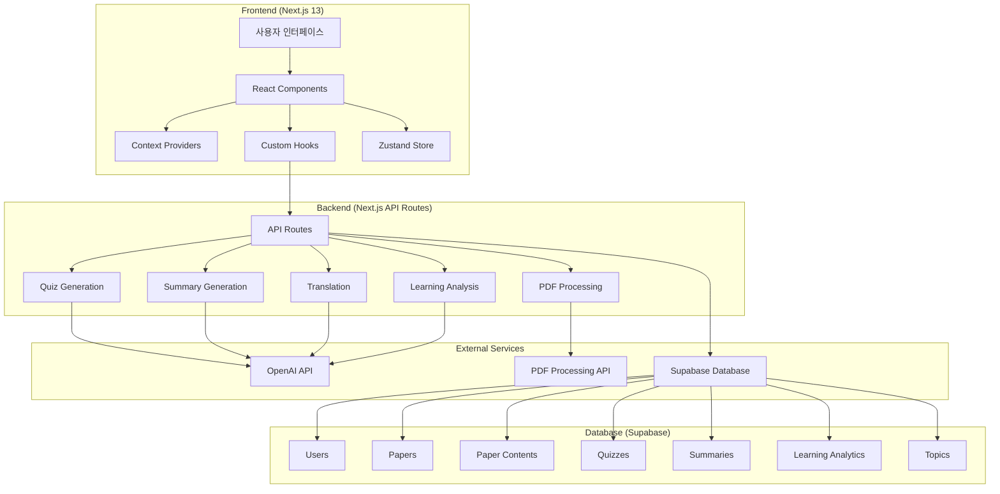
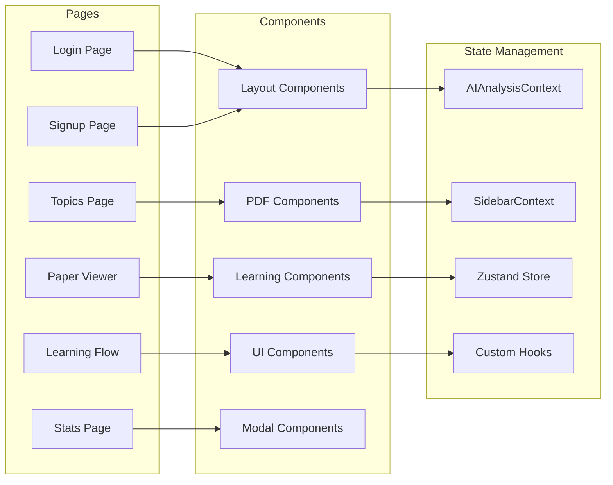
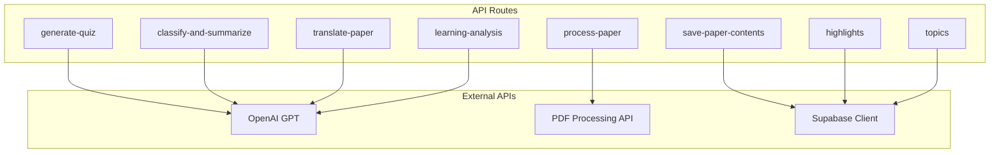
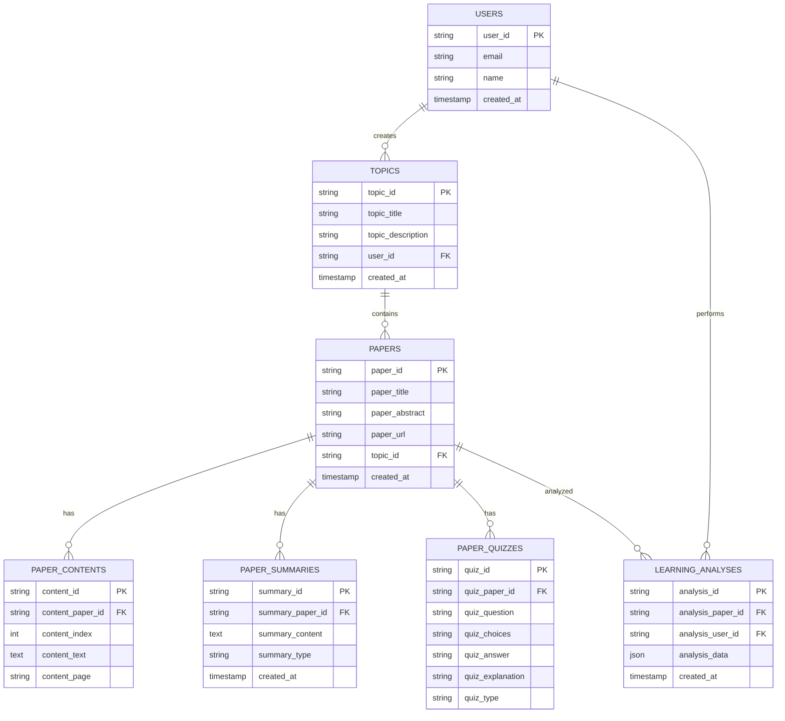
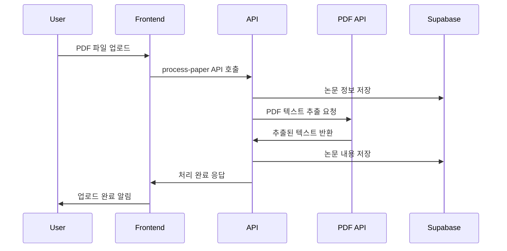
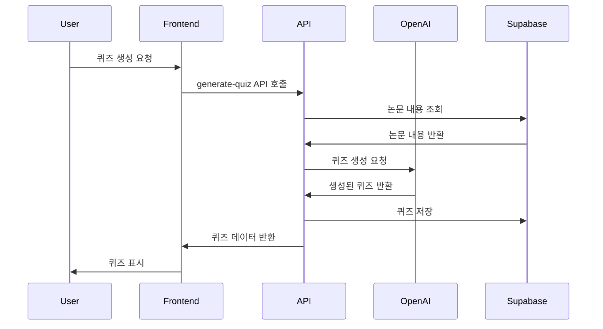
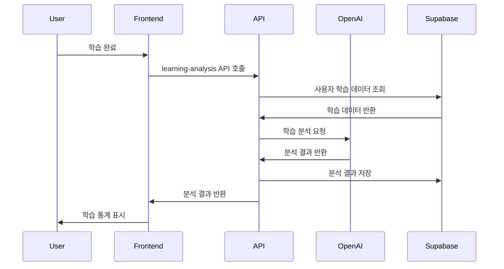

# Synthiq - AI 논문 학습 플랫폼 아키텍처

## 전체 시스템 아키텍처

## 상세 컴포넌트 아키텍처

### 1. 프론트엔드 레이어

### 2. API 레이어

### 3. 데이터베이스 스키마

## 기술 스택

### Frontend
- **Framework**: Next.js 13 (App Router)
- **Language**: TypeScript
- **UI Library**: React 18
- **Styling**: Tailwind CSS + Material-UI
- **State Management**: Zustand + React Context
- **PDF Viewer**: react-pdf
- **Rich Text Editor**: TipTap
- **Charts**: Chart.js + Recharts

### Backend
- **Runtime**: Node.js 22
- **API**: Next.js API Routes
- **Database**: Supabase (PostgreSQL)
- **Authentication**: Supabase Auth
- **File Storage**: Supabase Storage

### External Services
- **AI Services**: OpenAI GPT API
- **PDF Processing**: External PDF API
- **Real-time**: Supabase Realtime

## 주요 기능 플로우

### 1. 논문 업로드 및 처리 플로우

### 2. AI 퀴즈 생성 플로우

### 3. 학습 분석 플로우

## 보안 및 인증

- **Authentication**: Supabase Auth (JWT 기반)
- **Authorization**: Row Level Security (RLS)
- **API Security**: Next.js API Routes with middleware
- **Data Protection**: HTTPS, 환경변수 관리

## 성능 최적화

- **Frontend**: React.memo, useMemo, useCallback
- **Data Fetching**: SWR/React Query 패턴
- **Image Optimization**: Next.js Image 컴포넌트
- **Code Splitting**: Next.js 자동 코드 분할
- **Caching**: Supabase 캐싱, 브라우저 캐싱

## 확장성 고려사항

- **Microservices**: API Routes를 독립적인 서비스로 분리 가능
- **Database**: Supabase의 자동 스케일링
- **CDN**: 정적 자산 CDN 배포
- **Monitoring**: Supabase 대시보드, 로깅 